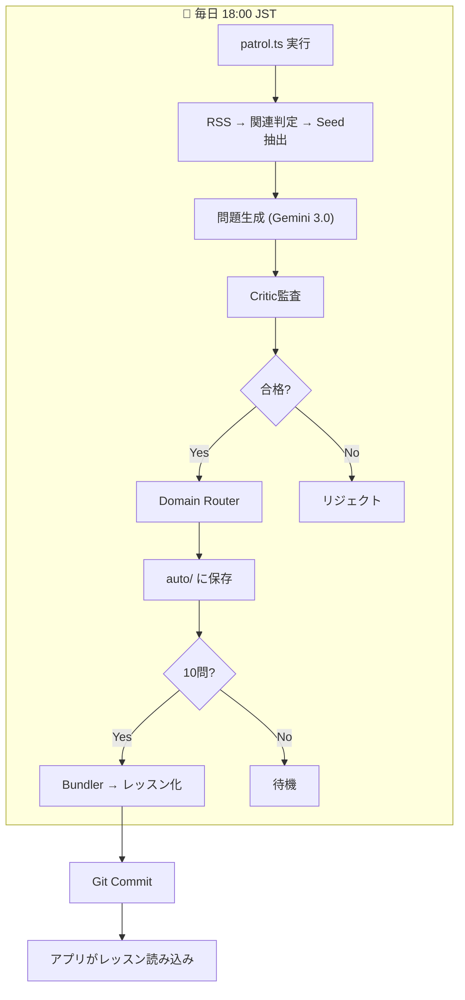

# Psycle Content System Specification
> Version 1.0 | 2024-12-24

## 設計思想

**「今は手動生成（Antigravity）→ 将来はAPI完全自動」に矛盾なく移行できる構造**

鍵は「生成エンジンだけ差し替え可能」にして、入出力（契約）と監査（Critic）と格納（Router/Bundler）を固定すること。

---

## 不変の原則（今も将来も同じ）

### 1. Seedスキーマ
```json
{
  "seed_id": "money_sunk_cost_001",
  "core_principle": "サンクコスト効果",
  "counter_intuitive_insight": "過去の投資は戻らない。判断は未来の価値で決める。",
  "actionable_tactic": "迷ったら『今から同じ金額を払う？』で判断する。",
  "domain": "money",
  "life_scene": "解約できないサブスク/行きたくない飲み会/続けるべき投資",
  "evidence_grade": "gold",
  "source_hint": "meta-analysis / high-tier journal",
  "risk_notes": "医療・投資助言は避ける"
}
```

### 2. Life-Scene First
- レッスンは「心理学原理を学ぶ回」ではなく「生活テーマ（シーン）を良くする回」
- 原理→シーン変換は生成プロンプトで行う（Seed構造は変えない）
- 見せ方はシーン、裏側は原理で矛盾しない

### 3. Lesson構造
- **10問 = 1レッスン**
- **2-3分で完了**
- テキストは2-3行以内

**詳細仕様**: [docs/PRINCIPLES.md](./PRINCIPLES.md) を参照

### 5. Critic（監査）
**採点しない。違反監査（Yes/No）のみ。**

**監査ルール**: [docs/PRINCIPLES.md](./PRINCIPLES.md) を参照

### 6. Domain Router
- **domain未定義 → Fail Fast（インポートしない）**
- 保存先: `data/lessons/{domain}_units/auto/`

### 7. Lesson Bundler
- `auto/` に **10問** 溜まったらレッスン化
- 出力: `{domain}_auto_l{nn}.ja.json`
- 使用済み問題は `bundled/` へ移動（重複防止）

---

## 可変部分（差し替え可能）

| 機能 | 今 | 将来 |
|------|-----|------|
| RSS巡回 | API自動 | API自動 |
| 関連性判定 | Gemini 2.5 | Gemini / 他モデル |
| Seed抽出 | Gemini 2.5 | Gemini / 他モデル |
| 問題生成 | Antigravity手動 or Gemini 3.0 | API完全自動 |
| 監査 | Gemini 2.5 | Gemini / 他モデル |

**入出力を同じにしておけば、どれも差し替え可能。**

---

## I/O契約（JSON構造・保存先・失敗時挙動）

### Input: Seed → Generator
```typescript
interface Seed {
  seed_id: string;
  core_principle: string;
  counter_intuitive_insight: string;
  actionable_tactic: string;
  domain: "social" | "mental" | "money" | "health" | "productivity" | "work";
  evidence_grade: "gold" | "silver" | "bronze";
}
```

### Output: Generator → Question
```typescript
interface Question {
  id: string;
  type: "swipe_judgment" | "multiple_choice" | "select_all" | "sort_order" | "conversation";
  question: string;
  domain: string;  // ← Seedから継承（必須）
  difficulty: "easy" | "medium" | "hard";
  xp: number;
  explanation: string;
  actionable_advice?: string;
  // ... type-specific fields
}
```

### Output: Bundler → Lesson
```typescript
// {domain}_auto_l{nn}.ja.json
type Lesson = Question[];  // 10問の配列
```

### 保存先マッピング
| domain | 保存先 |
|--------|--------|
| social | `data/lessons/social_units/auto/` |
| mental | `data/lessons/mental_units/auto/` |
| money | `data/lessons/money_units/auto/` |
| health | `data/lessons/health_units/auto/` |
| productivity | `data/lessons/study_units/auto/` |
| work | `data/lessons/work_units/auto/` |

### 失敗時挙動
| 失敗タイプ | 挙動 |
|------------|------|
| domain未定義 | Fail Fast（インポートしない） |
| Critic違反 | リジェクト（保存しない） |
| 10問未満 | bundler発動しない（待機） |

---

## 移行時に差分が出ない理由

1. **生成物（Question JSON）のスキーマが固定**
   - 誰が生成しても同じ形式

2. **後段パイプライン（Critic/Router/Bundler）が不変**
   - 生成エンジンだけ差し替え可能

3. **domain はSeedが持つ**
   - 生成AIに丸投げしない
   - ルールベースで補助可能

4. **Bundler前提の設計**
   - 1日の生成量に依存しない
   - API増量時も「溜まるスピードが上がるだけ」

---

## タスクリスト（現在の実装状況）

| タスク | 状態 | ファイル |
|--------|------|----------|
| Seedスキーマ定義 | ✅ | `types.ts` |
| 関連性判定 | ✅ | `extractor.ts` |
| Seed抽出 | ✅ | `extractor.ts` |
| 問題生成（Life-Scene First） | ✅ | `generator.ts` |
| Critic監査（5ルール） | ✅ | `critic.ts` |
| Domain Router | ✅ | `importer.ts` |
| Lesson Bundler | ✅ | `bundler.ts` |
| 日次自動実行 | ✅ | `update-content.yml` |
| Rate Limiting | ✅ | `patrol.ts` (sleep) |

---

## 運用フロー



---

## 次の一手

**今すぐやること:**
1. このままBundler中心で運用開始
2. 毎日「問題生成→監査→domain保存」が回ることを確認
3. 10問溜まったらレッスン化されることを確認

**将来やること:**
- API課金で生成量を増やす（構造は変えない）
- 生成エンジンを差し替える（入出力は同じ）
