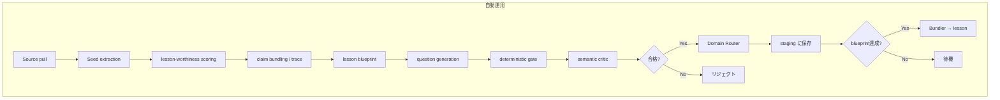

# Psycle Content System Specification
> Version 2.0 | 2026-04-15

## 設計思想

**Psycle は「研究を教えるアプリ」ではなく、「研究を使って選び方を少し変えるアプリ」である。**

そのため content system は以下を分離する。

- **Core Lane**: recurring pain（繰り返し起きる困りごと）から作る本体カリキュラム
- **Refresh Lane**: 新しい研究・知見で既存 lesson / unit を更新する補助レーン

鍵は、生成モデルに全部を決めさせず、
- 何を lesson にするか
- どの主張を使ってよいか
- どの密度で lesson を組むか

を明示契約として固定すること。

---

## 不変の原則（今も将来も同じ）

### Quick Reference Index

- `generation`
  - seed / claim / blueprint / novelty / bundling / refresh / mastery
- `runtime`
  - support lifecycle / fallback precedence / dependency / package state
- `analytics`
  - contract versioning / continuity events / threshold actions
- `ops`
  - readiness / promotion / deprecation / migration / kill switch
- `localization`
  - semantic parity / tone guard / localization owner

この index は導線であり、本文の契約を省略しない。

### Term Glossary

- `theme`
  - recurring pain を束ねる運用単位。manifest の主語。
- `unit`
  - lesson file 群のまとまり。実装上は theme と近いが、主に data grouping に使う。
- `lesson`
  - 1 job / 1 done condition を持つ最小学習単位。
- `variant`
  - 同一 theme 内の派生 lesson。mastery / refresh の具体単位。
- `package`
  - lesson を production 運用するための metadata 束。
- `continuity`
  - replace / merge / retire で route と履歴を接続する契約。
- `aftercare`
  - continuity 後に cleanup / redirect / analytics monitoring を行うルール。
- `fallback`
  - invalid package / invalid support から user を戻す route。
- `readiness`
  - promote 可否を決める operational gate の集合。

### 1. Seed / Claim / Lesson Blueprint の3段構造

content system は以下の順に処理する。

1. **Seed**: lesson 候補の種
2. **Claim**: source に紐づく主張単位
3. **Lesson Blueprint**: その lesson が何を変えるかを定義する設計図

Question は source を直接参照せず、**claim_id** 経由で evidence を追跡する。
Lesson は `新規作成 / Refresh / Return / Replay` を区別して扱う。

### 2. Seedスキーマ
```json
{
  "seed_id": "mental_rumination_001",
  "core_principle": "反芻は整理ではなく情動維持に寄りやすい",
  "counter_intuitive_insight": "考え続けるほど落ち着くとは限らない",
  "actionable_tactic": "まず『整理か反芻か』を見分ける",
  "domain": "mental",
  "life_scene": "夜に同じことを何度も考えて眠れない",
  "source_hint": "systematic review / replication / guideline",
  "risk_notes": "医療断定を避ける"
}
```

### 3. Claimスキーマ
```json
{
  "claim_id": "mental_rumination_claim_001",
  "claim_text": "反芻は問題解決より情動維持に寄りやすい",
  "source_id": "doi_10_xxxx",
  "source_type": "systematic_review",
  "evidence_grade": "gold",
  "source_span": "results section, p.4-5",
  "review_date": "2026-04-15",
  "allowed_usage": "causal_softened"
}
```

### 4. Lesson Blueprint
```json
{
  "lesson_job": "反芻を気づき、まず止まる入口を作る",
  "target_shift": "整理しているつもりの反芻を見分ける",
  "done_condition": "反芻と整理を見分け、次に取る小さい行動を1つ選べる",
  "load_score": {
    "cognitive": 2,
    "emotional": 2,
    "behavior_change": 2
  },
  "question_count_range": [7, 8],
  "forbidden_moves": ["self_blame", "causal_overclaim"]
}
```

### 5. Life-Scene First
- レッスンは「心理学原理を学ぶ回」ではなく「生活テーマ（シーン）を良くする回」
- 原理→シーン変換は blueprint 前提で行う
- 見せ方はシーン、裏側は原理で矛盾しない

### 6. Lesson構造
- **5-Phase骨格固定**
- **問数は lesson の重さで可変**
- **1 lesson = 1 job**
- **1 lesson = 1 done condition**
- **lesson blueprint を先に作る**
- **1 lesson = bounded scope**

詳細仕様は [PRINCIPLES.md](/Users/mashitashinji/dev/psych-duo-packs/psycle-expo/docs/PRINCIPLES.md) を参照。

### 7. Critic
- **deterministic gate** と **semantic critic** を分ける
- Critic は採点ではなく、reject / warn を返す

### 8. Domain Router
- **domain未定義 → Fail Fast**
- 保存先: `data/lessons/_staging/{domain}_units/`

### 9. Lesson Bundler
- `auto/` に blueprint の問数レンジを満たす問題が溜まったらレッスン化
- 使用済み問題は `bundled/` へ移動（重複防止）
- `Refresh lane` は既存 lesson 更新を優先し、既存 fit がある場合は新規 lesson を自動生成しない
- `Return` は短い再入場 lesson として扱い、core progression の代替にしない

---

## 可変部分（差し替え可能）

| 機能 | 今 | 将来 |
|------|-----|------|
| Source pull | RSS / registry / API | API / DB |
| Seed extraction | Gemini | Gemini / 他モデル |
| Claim extraction | Gemini + deterministic | 他モデル可 |
| Blueprint generation | Gemini + rules | 他モデル可 |
| Question generation | Gemini | 他モデル可 |
| Semantic critic | Gemini | 他モデル可 |

**差し替えてよいのはモデルであり、契約ではない。**

---

## I/O契約（JSON構造・保存先・失敗時挙動）

### Input: Seed → Blueprint
```typescript
interface Seed {
  seed_id: string;
  core_principle: string;
  counter_intuitive_insight: string;
  actionable_tactic: string;
  domain: "social" | "mental" | "money" | "health" | "productivity" | "work";
  life_scene: string;
}
```

### Input: Claim
```typescript
interface Claim {
  claim_id: string;
  claim_text: string;
  source_id: string;
  source_type: string;
  evidence_grade: "gold" | "silver" | "bronze";
  source_span: string;
  review_date: string;
  allowed_usage: string;
}
```

### Output: Generator → Question
```typescript
interface Question {
  id: string;
  type: "swipe_judgment" | "multiple_choice" | "select_all" | "sort_order" | "conversation";
  question: string;
  domain: string;
  phase: 1 | 2 | 3 | 4 | 5;
  difficulty: "easy" | "medium" | "hard";
  xp: number;
  explanation: string;
  claim_id: string;
  actionable_advice?: string;
}
```

### Output: Bundler → Lesson
```typescript
type Lesson = Question[];
```

### 保存先マッピング
| domain | 保存先 |
|--------|--------|
| social | `data/lessons/_staging/social_units/` |
| mental | `data/lessons/_staging/mental_units/` |
| money | `data/lessons/_staging/money_units/` |
| health | `data/lessons/_staging/health_units/` |
| productivity | `data/lessons/_staging/study_units/` |
| work | `data/lessons/_staging/work_units/` |

### 失敗時挙動
| 失敗タイプ | 挙動 |
|------------|------|
| domain未定義 | Fail Fast（保存しない） |
| claim trace 不完全 | リジェクト（保存しない） |
| stale evidence | リジェクト（保存しない） |
| deterministic gate 違反 | リジェクト（保存しない） |
| semantic critic 違反 | リジェクト（保存しない） |
| blueprint 未達 | bundler発動しない（待機） |

---

## Source Tier（自動運用前提）

### Tier A
- systematic review
- meta-analysis
- umbrella review
- guideline

### Tier B
- preregistered RCT
- replication
- strong longitudinal

### Tier C
- observational
- cross-sectional
- single small study

### Tier D
- narrative summary
- heuristic
- commentary

**自動運用ルール**
- lesson の土台に使ってよいのは **Tier A/B**
- Tier C/D は補助・仮説・試す視点に限定する

---

## 収集戦略

### Core Lane
- recurring pain を起点に組む
- 例: 反芻 / 比較 / 不安回避 / 先延ばし

### Mastery Lane
- 同じテーマを別 scene / 別判断 / 別再発文脈 / 別現実応用で深める
- 役割は `同じテーマでも別価値を返す` こと
- Core lesson の薄い言い換えは reject
- 新テーマ導入ではなく、既存テーマの定着と応用に使う
- 各 Mastery candidate は `scene_change | judgment_change | intervention_change | transfer_context | relapse_context` のいずれか1つを `novelty_reason` として持つ
- `theme_id` ごとに `max_active_mastery_slots` を持つ
- 上限超過時は追加生成ではなく `merge / replace / retire` を優先する
- runtime に流してよいのは `実在する mastery lesson inventory` のみ。placeholder lesson id を候補化しない
- volume proof:
  - [MASTERY_PROOF_RUMINATION.md](/Users/mashitashinji/dev/psych-duo-packs/psycle-expo/docs/MASTERY_PROOF_RUMINATION.md)
  - [MASTERY_PROOF_PROCRASTINATION.md](/Users/mashitashinji/dev/psych-duo-packs/psycle-expo/docs/MASTERY_PROOF_PROCRASTINATION.md)

#### Mastery Lesson Authoring Contract

mastery lesson は `core の言い換え` ではなく、`戻る / 見分ける / 別 scene に移す` のいずれかを前進させる。

最低限:
- file / lesson id は `*_mNN`
- question id は `{theme}_mNN_NNN`
- `novelty_reason` を 1 つ持つ
- `done condition` は `早く気づける / 戻る一手を選べる / transfer できる` のいずれかで書く
- 1 lesson 内に少なくとも 1 問は `transfer` か `re-entry` prompt を入れる

reject:
- `scene_only_change` だけ
- same conclusion を wording だけ変えた replay-like mastery
- `再発ゼロ` を done condition に置く mastery

### Refresh Lane
- 新しい研究で既存 lesson を更新する
- 例: explanation 更新 / intervention 更新 / evidence grade 更新
- まず既存 lesson / unit に fit するかを確認する
- 既存 fit がある場合は refresh candidate として backlog し、新規 core lesson は増やさない
- 各 Refresh candidate は `explanation_update | intervention_update | boundary_update | safety_update | scene_update | evidence_strength_update` のいずれか1つを `refresh_value_reason` として持つ
- `新しい論文が出た` だけでは Refresh 候補にしない
- wording-only / cosmetic-only update は Refresh 候補にしない
- `theme_id` ごとに `max_concurrent_refresh_candidates` を持つ
- 上限超過時は `priority_score` が低い候補を backlog から外すか統合する

### Mastery / Replay / Refresh / Return / Adaptive Resurfacing

- **Mastery**: 同テーマを別 scene / 別 question / 別 transfer で深める
- **Replay**: 同じ lesson をそのまま再実行
- **Refresh**: 同じテーマを別 scene / 別 question で再学習
- **Return**: 崩れた時に戻る短い recap lesson
- **Adaptive resurfacing**: 忘却・弱点・離脱点に応じて resurfacing

Psycle の「尽きなさ」は新 lesson 量産ではなく、この5系統で作る。

#### Runtime State Model

- `core_lesson`
  - curriculum の本編
  - progression を進める唯一の lesson 種別
- `mastery_variant`
  - `theme_id` と `parent_unit_id` を持つ post-core 変奏
  - progression を塞がずに深さを返す
  - `lesson_id = *_mNN` を持つ実在 lesson にだけ紐づく
- `replay_instance`
  - `lesson_id` 再実行
  - progression は進めない
- `refresh_variant`
  - `parent_lesson_id` を持つ別 variant
  - evidence 更新か scene 更新か intervention 更新の理由を必須にする
  - `replace existing lesson` か `add refresh variant` のどちらかを必須にする
- `return_lesson`
  - `parent_lesson_id` か `theme_id` にぶら下がる短い再入場 lesson
  - `3〜5問`
- `resurfacing_candidate`
  - `candidate_type`
  - `trigger_reason`
  - `signal_confidence`
  - `cooldown_key`
  - `priority_score`
  を持つ表示候補

#### Signal Confidence Model

`forgetting / avoidance / relapse / transfer_gap` は、心理状態ではなく行動ログから推定する signal として扱う。

- `low`
  - 単発の hesitation
  - 単発の abandon
  - 単発の replay 失敗
- `medium`
  - 同テーマで反復する hesitation / abandon
  - 応用系だけ弱い transfer gap
- `high`
  - 同テーマでの継続的離脱
  - 完了後の反復 return
  - forgetting / transfer gap / relapse が複数 signal で重なる

弱い signal は軽い resurfacing 候補化にのみ使う。

#### Runtime Trigger Logic

1. **Mastery**
   - trigger:
     - `unit.completed = true`
     - `theme mastery backlog > 0`
     - `inventory に未retire variant がある`
   - gate:
     - `parent_unit_id` 必須
     - `lesson_id = *_mNN` で実在 lesson inventory に存在する
     - `job / target_shift / takeaway_action` の少なくとも1つが既存 core lesson と差分あり
     - `scene_change | judgment_change | intervention_change | relapse_context | transfer_context` のいずれかを `novelty_reason` として持つ
   - reject:
     - runtime 上だけ存在する placeholder variant
     - 既存 core lesson の焼き直し
     - 新テーマ導入
     - progression を止める必須導線化

2. **Replay**
   - trigger: user 明示選択のみ
   - gate:
     - `lesson.completed = true`
     - `candidate_type = replay`
   - reject:
     - auto surface しない
     - progression 代替にしない

3. **Refresh**
   - trigger:
     - `lesson.completed = true`
     - 既存 lesson に対する `evidence_update | intervention_update | scene_update` がある
   - gate:
      - `parent_lesson_id` 必須
      - `job / target_shift / takeaway_action` の少なくとも1つが既存と差分あり
      - `refresh_value_reason` 必須
      - `replacement_mode = replace | variant` を明示できる
   - reject:
      - 既存 lesson と価値重複
      - wording-only / cosmetic-only update
      - 新規 core lesson の代替として乱用

4. **Return**
   - trigger:
     - `abandon_count >= 2`
     - または `partial_completion` 後に再開なし
     - または明確な `weakness_signal`
   - gate:
     - `question_count <= 5`
     - job は `re-enter / stabilize / resume` のいずれか
   - reject:
     - 新知識の導入
     - 長い説明
     - core lesson の完全代替

5. **Adaptive resurfacing**
   - trigger input:
     - `weakness_score`
     - `forgetting_score`
     - `abandonment_score`
   - candidate rule:
     - 3 score 合計が閾値以上で候補化
   - selection rule:
     - 候補は複数作ってよい
     - ただし surface は常に1件のみ
     - 優先順は `最小介入で戻せるもの`
      - `signal_confidence` が low の場合は path を塞がない

#### Non-Punitive Runtime Rule

state signal は resurfacing の選定にのみ使う。

禁止:
- signal を使って energy cost を増やす
- signal を使って streak を罰する
- signal を使って reward を減らす
- signal を使って paywall を深くする

許可:
- 軽い re-entry を優先する
- support candidate の順序を変える
- path へ戻る最短導線を提示する

#### Anti-Farming Rule

- `XP / reward / progress` は lesson 長さではなく `learning_value_weight` で正規化する
- `Return / Adaptive` は救済導線であり、主要な稼ぎ導線にしない
- 同一 theme / 同一 support kind の反復で進捗が過剰に進まないようにする

#### Support Surfacing Cooldown

同じ resurfacing を短期間で何度も出しすぎないため、少なくとも以下の cooldown を持つ。

- `same_kind_cooldown`
- `same_theme_cooldown`
- `same_parent_lesson_cooldown`

cooldown 中は、別 candidate がより高い価値を持たない限り再 surfacing しない。

#### Support Dosage

cooldown とは別に、support の週次総量を制御する。

- `weekly_support_budget`
- `weekly_support_by_kind`
- `weekly_support_by_theme`

上限を超えた場合は、同一週では path を優先する。

#### Re-entry Dignity

`Return / Adaptive` は、進行に遅れたユーザーを罰する UI にしない。

- `copy_tone = neutral_or_inviting`
- `reward_tone = comeback_or_support`
- `shame_signal = disallowed`

再入場は `recovery lane` であり、`failure lane` として扱わない。

#### Selection Order

- 基本は `path / core progression` を優先する
- まず `Return` で戻す必要があるかを見る
- Return が不要で、明確な弱点補修が必要なら Adaptive resurfacing
- Adaptive が不要で、同テーマを深める価値が高いなら Mastery
- Adaptive / Mastery が不要で、既存 lesson の更新価値があるなら Refresh
- Refresh が不要で、明示的復習要求かつ時間経過条件を満たすなら Replay
- 新規 progression は resurfacing 候補が path を上書きしない時に進める
- low confidence signal では path を止めない
- cooldown 中の同一 candidate は選定しない
- interleaving 可能な時は、同一 theme の連打より別 theme を挟む
- dependency を満たさない theme を先に surfacing しない

#### Mastery Graduation

各 Mastery theme は `graduation_state` を持つ。

最低限見るもの:
- `scenes_cleared_count`
- `transfer_improvement`
- `repeat_without_dropoff`

`attempt_count` 単独で卒業判定しない。

各 mastery variant 完了時は最低限:
- 当該 `variant_id` を `retired_variant_ids` に移す
- `active_variant_ids` から外す
- `scene_ids_cleared` と `attempt_count` を更新する
- `repeat_without_dropoff / repetition_risk / transfer_gain_slope` を再評価する

`graduated` または `ceiling_reached` になった theme は、active variant を惰性で保持しない。

#### Mastery Ceiling

各 theme / mastery cluster は `mastery_ceiling_state` を持つ。

最低限見るもの:
- `new_learning_value_delta`
- `transfer_gain_slope`
- `repetition_risk`

ceiling 到達後は `new mastery` を追加せず、`Refresh / merge / next theme surfacing` を優先する。

#### False Mastery Rule

以下は mastery の証拠として不十分:
- 高 completion だけ
- 高 accuracy だけ
- 高 attempt_count だけ

最低限、`transfer_improvement` か `scene generalization` のどちらかを伴わない限り graduation しない。

#### Verification Targets

- 同一 theme で `また同じ内容` と感じる report が増えていない
- Mastery が core lesson の焼き直しになっていない
- Return が長すぎて completion を落としていない
- Refresh が core progression を食っていない
- resurfacing 候補の同時表示が発生しない
- surfaced support に `shown / started` の analytics が欠けていない
- inventory に存在しない mastery lesson id が runtime surfacing されていない
- replace / merge 後も旧 lesson 完了者の next route が断裂していない
- support dosage を上げても path completion が落ちていない
- 同じ support kind が短期間に連打されていない
- theme ごとの在庫が偏っていない
- 短い lesson / 無料 support だけで progress farming が起きていない
- interleaving が効いていて、同一 theme 連打になっていない

#### Long-Term Supply Audit

各テーマごとに定期監査を行う。

監査対象:
- `core_count`
- `mastery_count`
- `return_count`
- `refresh_candidate_count`
- `theme_coverage`
- `duplicate_pressure`
- `repetition_risk`
- `retire_candidates`
- `mastery_graduation_state`
- `theme_dependency_health`
- `theme_saturation_state`

監査目的:
- `理論上尽きない` を `実在庫がある` に変える
- Mastery / Refresh の新しさ不足を早期に検知する
- 同じテーマで lesson を足しすぎて repetition risk が上がっていないか確認する
- retire / merge / replace を先に検討し、単純加算を避ける
- 卒業済み Mastery を惰性で出し続けていないか確認する
- dependency が破綻して path が分かりにくくなっていないか確認する
- saturation 済み theme を惰性で拡張していないか確認する

#### Retire / Merge / Replace

以下を満たす lesson は retire 候補にする:
- stale evidence で更新不能
- 新しい lesson と `job / target_shift / takeaway_action` が重複
- repetition risk が高い
- refresh によって実質置換済み

retire は削除だけでなく `archive / replace / merge` を含む。

#### Lesson Replacement Continuity

replace / merge / retire する lesson は continuity metadata を持つ。

最低限:
- `replaced_by_lesson_id | merged_into_lesson_id`
- `continuity_route`
- `history_migration_rule`
- `support_redirect_rule`
- `analytics continuity rule`

これが揃わない置換は promote しない。

runtime / analytics / resurfacing は、旧 lesson の完了履歴と次導線を断裂させない。

#### Replacement Aftercare Contract

continuity metadata とは別に、置換後の aftercare metadata を持つ。

最低限:
- `aftercare_window_days`
- `legacy_candidate_suppression_rule`
- `in_flight_user_route = restart | continue_to_replacement | return_then_rejoin`
- `stale_mastery_cleanup_rule`
- `legacy_vs_replacement_analytics_window`

旧 lesson 由来の support / mastery / refresh candidate を放置しない。
aftercare contract がない replace / merge は promote しない。

#### Continuity Mode Decision Contract

`continuity_mode` は file 名ではなく migration 責務で決める。

- `net_new`
  - predecessor なし
  - history migration なし
  - continuity route は `start_here`
- `replace`
  - 単一 predecessor から主導線を引き継ぐ
  - history migration / support redirect / analytics continuity が必要
- `merge`
  - 複数 predecessor を 1 lesson に統合する
  - predecessor ごとの aftercare と analytics continuity が必要
- `retire`
  - 後継 lesson は任意
  - runtime route が `null` になり得るので fallback user route を必須にする

`どの mode か説明できない` package は staging に留める。

#### Deprecation SLA Contract

deprecated / replaced lesson は cleanup の期限を持つ。

最低限:
- `deprecation_start_at`
- `compatibility_window_days`
- `cleanup_due_at`
- `migration_complete_condition`

SLA を超えた legacy lesson は、放置ではなく failure backlog に送る。

#### Theme Entry / Exit

各 theme は `entry_state` と `exit_state` を持つ。

最低限:
- `recurring_pain_clarity`
- `dependency_fit`
- `proof_of_supply`
- `theme_unique_value`
- `core_coverage_state`
- `marginal_core_value`
- `saturation_state`

entry は core path 候補化の条件、exit は mastery / refresh 中心へ移す条件として扱う。

#### Theme Dependency Map

各 theme は以下を持つ:
- `prerequisite_themes`
- `prerequisite_skills`
- `unlock_conditions`

path / mastery / refresh のいずれでも、dependency を壊す並びを許可しない。

#### Theme Dependency Metadata Schema

dependency metadata の canonical source は theme 単位の manifest に置く。

canonical path:
- `data/themes/{theme_id}.meta.json`

最低限:
```typescript
interface ThemeDependencyManifest {
  theme_id: string;
  prerequisite_themes: string[];
  prerequisite_skills: string[];
  unlock_conditions: string[];
  dependency_bypass_rules: string[];
  replacement_aftercare_defaults?: {
    aftercare_window_days: number;
    legacy_candidate_suppression_rule: string;
  };
}
```

lesson 単位 file に dependency 条件を分散させない。runtime / generator / analytics は同じ manifest を読む。

#### Dependency Enum Contract

manifest の `unlock_conditions` と `dependency_bypass_rules` は allowed enum からのみ選ぶ。

```typescript
type UnlockCondition =
  | "core_path_available"
  | "prerequisites_completed"
  | "theme_manifest_active"
  | "inventory_available"
  | "manual_release_window_open";

type DependencyBypassRule =
  | "none"
  | "human_reviewed_migration"
  | "safety_hotfix"
  | "kill_switch_recovery"
  | "experiment_override";
```

enum 外の値を production manifest に入れてはならない。

#### Theme Manifest Required Fields

theme manifest は dependency だけでなく運用状態も持つ。

最低限:
```typescript
interface ThemeOperationalManifest {
  owner: string;
  last_reviewed_at: string;
  review_cycle_days: number;
  rollout_stage: "draft" | "staging" | "production_limited" | "production_default";
  saturation_state: "growing" | "saturated" | "retiring";
  theme_status: "active" | "deprecated" | "archived";
}
```

production の theme manifest に `owner`、`last_reviewed_at`、`review_cycle_days` が欠けていてはならない。

#### Theme Manifest Versioning Contract

theme manifest schema は versioning を持つ。

最低限:
```typescript
interface ThemeManifestVersioning {
  schema_version: number;
  migration_rule: string;
  backward_compat_window_days: number;
}
```

破壊的変更を silent fallback で吸収しない。loader は未知 version を warn ではなく migration-required として扱う。
migration playbook:
- migrate order: `theme manifest -> continuity metadata -> content_package -> runtime loader/validator`
- loader が新 version を読める前に production data を切り替えない
- `backward_compat_window_days` 経過後は旧 version を reject し、warning-only にしない
- `migration-required` は staging で fail-close、production default では promote 不可
- rollback は data version と loader version を pair で戻す

#### Skill Transfer

各 transferable skill は以下を持つ:
- `skill_id`
- `origin_themes`
- `target_themes`
- `transfer_evidence`
- `reuse_conditions`

theme progression は `theme completion` だけでなく `transferable skill reuse` でも評価する。

#### Theme Dependency Contract

各 theme は必要に応じて `dependency_themes` を持つ。

- dependency 未充足の theme は core path に早出ししない
- dependency 未充足の `Mastery / Refresh` は surfacing しない
- dependency がある theme を深掘りする前に、前提 theme の core completion か同等 skill reuse を確認する

theme ordering は copy ではなく dependency contract で決める。

#### Refresh Eligibility Threshold

Refresh は以下のいずれかが **実質更新** として確認できる時のみ候補化する。

- `explanation_update`
- `intervention_update`
- `boundary_update`
- `safety_update`
- `scene_update`
- `evidence_strength_update`

cosmetic update や wording-only update は Refresh 候補にしない。

#### Refresh Conflict Priority

Refresh 候補が複数ある時は以下の順で処理する。

1. `safety_update`
2. `intervention_update`
3. `explanation_update`
4. `scene_update`

上位 priority の refresh が同一 learning slot にいる場合、下位 priority を先に promote しない。

#### Support Dosage Contract

runtime は support を `出せるだけ出す` のではなく、dose を管理する。

- `weekly_support_budget`
- `same_kind_cooldown`
- `same_theme_cooldown`
- `same_lesson_cooldown`

を最低限持つ。

verification:
- support surfacing を増やしても core path の started/completed が悪化しない
- same theme support の短期連打が起きない
- free / short support だけで progress farming が起きない

#### Support Success / Failure Threshold Contract

support 運用は threshold config を持つ。

最低限:
- `path_start_guardrail`
- `path_completion_guardrail`
- `support_repeat_cap`
- `support_only_progress_cap`
- `support_start_rate_floor`

判定:
- support surfacing 増加後に `path_start` または `path_completion` が guardrail を割ったら failure
- `same_theme_support_repeat_rate` が cap を超えたら overdose
- `support_only_progress_share` が cap を超えたら farming 疑い
- `support_started / support_shown` が floor を割るのに surfacing だけ増えるなら noise 判定

threshold 未設定の support policy は production readiness を満たさない。

#### Threshold To Action Contract

threshold は観測用ではなく、運用 action を引くために使う。

- `path_start_guardrail` failure
  - reduce support surfacing
  - lower current theme support priority
- `path_completion_guardrail` failure
  - tighten weekly support budget
  - suppress non-return resurfacing
- `same_theme_support_repeat_rate > support_repeat_cap`
  - extend cooldown
  - suppress low-confidence support
- `support_only_progress_share > support_only_progress_cap`
  - review reward / progression coupling
  - force path-first CTA
- `support_started / support_shown < support_start_rate_floor`
  - demote noisy support kind
  - review trigger or copy

threshold failure に action mapping がない policy は production readiness を満たさない。

同順位の時のみ、evidence strength と replacement pressure で tie-break してよい。

#### Theme Saturation

以下を満たす時、その theme は saturation 候補とみなす:
- `theme_coverage` は十分
- `refresh_candidate_count` は低い
- `repetition_risk` は高い

saturation 候補では、新規 lesson 追加より `merge / replace / retire` を優先する。

#### Override Authority Contract

以下は明示 override なしで production に通してはならない:
- `refresh priority` の逆転
- `dependency bypass`
- `saturation 済み theme` への追加

override metadata:
- `reason`
- `owner`
- `timebox`
- `rollback_condition`

恒久 override をデフォルトにしない。期限切れ override は fail で扱う。

#### Policy Precedence Contract

rule collision 時は、以下の優先順位を使う。

1. `safety_boundary`
2. `claim_traceability`
3. `continuity_and_aftercare`
4. `dependency_integrity`
5. `kill_switch_or_rollback`
6. `path_first_progression`
7. `support_rescue_or_dosage_optimization`
8. `experiment_preference`

適用例:
- rescue surfacing が有効でも dependency を壊すなら reject
- refresh candidate が強くても continuity metadata が欠けるなら staging 止まり
- experiment flag があっても kill switch 発火条件を上書きしない

#### Theme Drift

各 theme は `theme_drift_state` を持つ。

最低限見るもの:
- `recurring_pain_alignment`
- `lesson_job_spread`
- `target_shift_spread`
- `cross_theme_overlap`

drift が高い場合は、同一 theme の拡張を止めて `split / merge / retire` を優先する。

#### Scope Creep Guard

各 lesson blueprint は `non_goals` を持つ。

最低限:
- `must_cover`
- `must_not_expand_into`
- `split_if_needed_topics`

generator / critic は、lesson が blueprint の scope を越えていないかを検証する。

#### Minimum Novelty Threshold

新規 Core lesson は、最低でも以下のいずれか1つが既存 lesson と異ならなければならない。

- `lesson_job`
- `target_shift`
- `takeaway_action`
- `counterfactual`
- `intervention_path`

`scene_only_change` で learning value が変わらないものは reject する。

#### Claim Usage Boundary

各 claim は `allowed_usage_scopes` を持つ。

候補値:
- `fact`
- `explanation`
- `intervention`

generator / critic / bundler は、question の用途が claim の使用境界を越えていないかを検証する。

#### Counterfactual Coverage

`better_choice` 系 lesson / question は、比較対象も持つ。

最低限:
- `baseline_or_do_nothing`
- `worse_or_costlier_choice`
- `why_this_is_better`

を持ち、fear copy ではなく比較説明として出す。

#### Evidence Conflict

複数の強い source が矛盾する場合、candidate / lesson は `evidence_conflict_state` を持つ。

最低限:
- `conflicting_claim_ids`
- `conflict_type`
- `safe_usage_scope`
- `refresh_or_review_route`

conflict 中は、intervention を弱めるか、refresh/review queue に送る。

#### Observability / Rollback

新しい surfacing / reward / lesson strategy を入れる時は、最低限
- `success_metrics`
- `rollback_conditions`
を持つ。

runtime 施策は、観測できないまま常設しない。

#### Promotion Readiness Contract

`staging -> production` の promote は readiness contract を満たす必要がある。

最低限:
- `quality_gate_pass = true`
- `dependency_valid = true`
- `continuity_complete = true`
- `analytics_wired = true`
- `rollback_defined = true`

いずれかが欠ける candidate は staging に留める。

#### Emergency Kill Switch Contract

runtime / content pipeline は即時停止できる単位を持つ。

最低限:
- `kill_scope = theme | support_kind | refresh_lane | promotion_pipeline`
- `trigger_condition`
- `owner`
- `restore_condition`
- `fallback_user_route`

bad content 混入や analytics 異常時に、deploy 以外の手段で止められなければならない。

#### Kill Switch Granularity Contract

kill switch は coarse stop だけでなく局所停止を許す。

最低限:
- `kill_scope = theme | support_kind | refresh_lane | analytics_event_family | promotion_pipeline`

期待動作:
- copy / CTA 問題は `support_kind` を止めればよく、theme 全停止をデフォルトにしない
- refresh lane の contamination は `refresh_lane` だけ止められる
- analytics naming / duplication 異常は `analytics_event_family` 単位で無効化できる
- pipeline stop は `new promote only` に効き、既存 production route を壊さない

最小停止単位が未定義の kill switch は production ops readiness を満たさない。

#### Analytics Metric Ownership Contract

guardrail / threshold metric は ownership を持つ。

最低限:
- `metric_owner`
- `review_cadence_days`
- `change_authority`
- `threshold_change_log`

owner がない metric は monitor 対象ではなく、未管理設定として扱う。

#### Validation Ownership Matrix

validation は layer ごとに primary owner を持つ。

最低限:
```typescript
interface ValidationOwnershipMatrix {
  generator: string[];
  runtime: string[];
  analytics: string[];
  content_ops: string[];
}
```

期待責務:
- `generator`: blueprint shape, novelty gate, claim usage boundary
- `runtime`: dependency integrity, surfacing rules, cooldown, dosage
- `analytics`: shown/started/completed continuity, guardrail metrics
- `content_ops`: promotion readiness, deprecation SLA, manifest hygiene

同じ検証を二重化してもよいが、primary owner が空の rule は production readiness を満たさない。

#### Experiment Boundary Contract

experiment でも破ってはならない invariant を固定する。

禁止:
- safety boundary を緩める
- claim traceability を外す
- analytics continuity を切る
- dependency を壊す恒久 path を作る

一時的に調整してよいもの:
- surfacing order
- support threshold
- copy
- rollout scope

各 experiment は最低限:
- `hypothesis`
- `success_metric`
- `failure_condition`
- `rollback_date`

を持つ。期限切れ experiment は production default に残さない。

#### Stale Evidence SLA Contract

claim / lesson は stale evidence の処置契約を持つ。

最低限:
- `review_sla_days`
- `expiry_action = auto_hide | auto_demote | refresh_queue`
- `last_verified_at`
- `next_review_due_at`

強い intervention claim ほど短い SLA を持つ。
期限切れ evidence を含む package は production readiness を満たさない。

#### Stale Evidence Severity Tier Contract

stale policy は claim tier ごとに持つ。

最低限:
- `severity_tier = A | B | C`

期待:
- `A`
  - safety / intervention / strong prescription
  - shortest SLA
  - default expiry action: `auto_hide`
- `B`
  - mechanism / explanation / bounded recommendation
  - medium SLA
  - default expiry action: `auto_demote | refresh_queue`
- `C`
  - framing / reflection / low-risk explainer
  - longest SLA
  - default expiry action: `refresh_queue`

high-risk claim に `C` tier を付けてはならない。
low-risk explainer に `A` tier を機械的に付けてはならない。

#### Stale Evidence Routing

stale evidence は next route を 1 つ持つ。

- `auto_hide`
  - stale のまま表示すると危険
- `auto_demote`
  - lesson 本体では使えないが、補助としては残せる
- `refresh_queue`
  - update すれば再利用価値がある

route ごとに最低限:
- `owner`
- `next_review_due_at`
- `refresh_value_reason_candidate?`

stale を検知しても route が決まらない package は production readiness を満たさない。

#### Content Package Contract

promotion の最小単位は lesson 単体ではなく package とする。

最低限:
```typescript
interface ContentPackage {
  lesson_path: string;
  evidence_path: string;
  theme_manifest_path: string;
  continuity_metadata_path?: string;
  analytics_contract_id: string;
  analytics_contract_version: number;
  analytics_schema_lineage: string;
  analytics_backward_compat_until: string;
  package_dependencies: {
    requires_package_ids: string[];
    dependency_rule: string;
    invalidation_rule: string;
  };
}
```

`analytics_contract_id` だけがあって version / lineage / backward compat がない package を許可しない。

#### Package Completeness Contract

production package は file presence だけでなく運用 completeness を持つ。

最低限:
- `localized_copy_ready`
- `analytics_contract_named`
- `rollback_route_present`
- `owner_assigned`
- `readiness_authority_complete`

`lesson + evidence + continuity` があっても、上記が欠ける package は complete とみなさない。

#### Analytics Contract Versioning Contract

analytics contract は id だけでなく versioning を持つ。

最低限:
- `analytics_contract_id`
- `analytics_contract_version`
- `analytics_schema_lineage`
- `analytics_backward_compat_until`

旧 package が旧 contract を使い続ける場合でも、backward compatibility window を持たずに放置しない。
contract migration では `vN` と `vN+1` の dual-emit window を持ち、`analytics_backward_compat_until` を過ぎた旧 contract package を production default に残さない。
migration playbook:
- `dual_emit_start_at` を持つ
- `production_default` package は dual-emit 期間中のみ `vN` と `vN+1` を並行 emit してよい
- `production_limited / staging` package は新 contract のみでよい
- `analytics_backward_compat_until` 到達後は旧 contract emit を止め、旧 contract 専用 package を default surfacing に残さない
- migration failure は fail-open せず `production_limited` か `staging` に降格する

#### Package Dependency Graph Contract

package は theme dependency だけでなく package dependency を持てる。

最低限:
- `package_dependencies.requires_package_ids`
- `package_dependencies.dependency_rule`
- `package_dependencies.invalidation_rule`

`refresh / mastery` package が依存先 package を失っても、dependency graph なしに production へ残さない。
runtime access 判定では依存先 package の availability を再評価し、依存先が `production` でない、あるいは killed / retired / stale / dependency unmet で落ちる場合、依存元 package も `dependency_unmet` として launch と surfacing の両方を止める。
dependency 喪失後の aftercare:
- dependency package が `killed` なら依存元 package を `hard rollback` 候補へ送る
- dependency package が `deprecated / retired` なら依存元 package を `refresh_queue` か `deprecated` に送る
- dependency package が stale / review overdue / dependency unmet なら依存元 package を `production_default` から外し `production_limited` か `refresh_queue` に送る
- dependency を失った package は active support candidate として残さない

#### Package Lifecycle State Contract

package は lifecycle state を持つ。

最低限:
- `state = draft | staging | production | deprecated | killed`

遷移条件:
- `draft -> staging`
  - package shape valid
  - dependency valid
- `staging -> production`
  - readiness complete
  - completeness complete
- `production -> deprecated`
  - continuity metadata present
  - aftercare active
  - cleanup_due_at set
- `production -> killed`
  - kill switch triggered
  - fallback user route active

禁止遷移:
- `draft -> production`
- `deprecated -> production`
- `killed -> production`
- `killed -> deprecated`

state を飛ばす promote / retire を許可しない。

#### Rollback Action Class Contract

rollback は action class を持つ。

最低限:
- `rollback_class = soft | hard | analytics_only`

期待:
- `soft`
  - surfacing disable
  - package remains installed
- `hard`
  - route disable
  - candidate disable
  - replacement or fallback route required
- `analytics_only`
  - content live
  - analytics emit disabled

`rollback_route` だけあって `rollback_class` がない package は rollback_defined とみなさない。

#### Cross-File Consistency Contract

theme manifest / content package / continuity / evidence は相互矛盾してはならない。

最低限:
- `theme_status=deprecated` の theme に新規 `package.state=production` を作らない
- `theme_status=archived` の theme に `staging / production` package を残さない
- `package.state=killed` の lesson は active support candidate を持たない
- `continuity_mode=retire` package は `production-default` 扱いしない
- `severity_tier=A` かつ stale package は `production` に残さない
- `review_cycle_days` 超過かつ `rollout_stage=production_default` の theme に support candidate を残さない

single-file validator だけ通っても、cross-file rule を破れば promote しない。

#### Support / Package Coupling Contract

support runtime は package state を尊重しなければならない。

最低限:
- `package.state != production` の lesson を support candidate にしない
- `theme_status != active` の theme を support candidate にしない
- `prerequisite_themes` 未充足の theme を support candidate にしない
- `severity_tier=A` かつ stale package を support candidate にしない
- `review_cycle_days` 超過かつ `rollout_stage=production_default` の theme を support candidate にしない

#### Support Lifecycle State Contract

support runtime は lifecycle state を持つ。

最低限:
- `shown`
- `started`
- `completed`
- `suppressed`
- `killed`

期待:
- `shown -> started`
- `started -> completed`
- `shown|started -> suppressed`
- `shown|started -> killed`

同じ candidate を `shown` のまま再 surfacing して state を重複生成しない。
runtime guard で package/theme/dependency invalid になった support は `killed` へ遷移し、`course_support_killed` を 1 回 emit して active candidate を cleanup する。

#### Support / Package State Mapping Contract

support lifecycle と package state の対応は 1 枚で読む。

| package / runtime condition | support state |
|---|---|
| `production` + theme active + dependency valid | `shown -> started -> completed` |
| cooldown / dosage / review overdue / stale gate | `suppressed` |
| `deprecated` | 新規 `shown` 禁止 |
| `killed` | 新規 `shown` 禁止、既存 `shown|started` は `killed` |
| package/theme/dependency invalidated during active support | `killed` |

`suppressed` は再入場余地あり、`killed` は runtime access 喪失として扱う。

#### Autonomous Ops SLA Matrix Contract

autonomous ops は期限超過時の route を持つ。

最低限:
- `next_review_due_at` exceeded
  - `Tier A -> auto_hide`
  - `Tier B -> auto_demote | refresh_queue`
  - `Tier C -> refresh_queue`
- `cleanup_due_at` exceeded
  - `deprecated package -> hard rollback candidate`
- `review_cycle_days` exceeded
  - `theme manifest -> production_limited candidate`
- `compatibility_window_days` exceeded
  - `legacy continuity route -> cleanup queue`

SLA breach を warning-only で放置する運用を production default にしない。
alert/action table:
- `Tier A stale` or `package_killed` -> `kill switch | hard rollback`
- `review_cycle_days` exceeded on `production_default` -> `production_limited`
- persistent `dependency_unmet` -> `refresh_queue`, threshold breach -> `deprecated`
- `analytics threshold breach` -> `analytics_only_rollback | production_limited`

#### Runtime Fallback Precedence Contract

runtime fallback は競合時の優先順位を持つ。

最低限:
- `package.state=killed`
- `continuity_mode=retire`
- `theme_status != active` または dependency unmet
- `severity_tier=A` かつ stale
- `package.state != production`
- `review_cycle_days` 超過の `production_default`

上位理由が出た時は、下位理由で上書きしない。
route 決定:
- `package_killed -> hard rollback | emergency fallback route`
- `continuity_retired -> continuity metadata の fallback_user_route`
- `dependency_unmet -> refresh_queue | return_then_rejoin | theme top`
- `theme_not_active -> theme top | replacement route`
- `tier_a_stale | package_not_production | theme_review_overdue -> production_limited route`

#### Route Table Summary Contract

`fallback / rollback / refresh_queue` の route 名はこの表に揃える。

| reason | first route | secondary route |
|---|---|---|
| `package_killed` | `hard rollback` | `emergency fallback route` |
| `continuity_retired` | `fallback_user_route` | `theme top` |
| `dependency_unmet` | `refresh_queue` | `return_then_rejoin`, then `theme top` |
| `theme_not_active` | `replacement route` | `theme top` |
| `tier_a_stale / package_not_production / theme_review_overdue` | `production_limited` | `refresh_queue` |

runtime / analytics / ops が別名 route を持つ状態を許可しない。

#### Readiness Authority Contract

`content_package.readiness` は field ごとに authority を持つ。

- `quality_gate_pass`
  - owner: `content_ops`
  - auto source: deterministic validator
  - final approval: approved source only
- `dependency_valid`
  - owner: `runtime`
  - auto source: manifest validator
  - override: approved bypass only
- `continuity_complete`
  - owner: `content_ops`
  - auto source: continuity / aftercare validator
  - final approval: redirect and analytics continuity complete
- `analytics_wired`
  - owner: `analytics`
  - auto source: contract checker
  - final approval: continuity events verified
- `rollback_defined`
  - owner: `content_ops`
  - auto source: rollback metadata checker
  - final approval: rollback route + owner present

authority が未定義の readiness field は production readiness を満たさない。

この束が揃わない candidate は staging から出さない。

#### Localization Parity Fail Criteria Contract

localization は copy translation ではなく semantic parity を要求する。

fail:
- `claim strength` が base locale より強くなる、または弱くなり outcome が変わる
- `shame / threat / blame` tone が任意 locale に混入する
- `better choice` wording が命令調や断罪調に変質する
- safety boundary / contraindication / fallback wording の欠落または意味反転

pass:
- `semantic_parity_rule` を満たす
- `localization_owner` が parity basis を説明できる
- locale 間で lesson outcome と support route が変わらない

#### Review Authority Matrix Contract

変更種別ごとに required assurance を固定する。

high-assurance autonomous decision required:
- `safety_update`
- `dependency_bypass`
- `replace_or_merge_continuity_migration`
- `threshold_change`
- `kill_switch_restore`

approved source only:
- `quality_gate_pass`
- `dependency_valid`
- `analytics_wired`
- `rollback_defined`

最低限:
- `approved_source`
- `review_reason`
- `reviewed_at`
- `rollback_trigger_if_reverted`

high-assurance change が autonomous decision metadata なしで promote される状態を許可しない。

#### Autonomous Evidence Scaffold Defaults Contract

production path に出る scaffold は、初期値の時点で運用契約を満たしていなければならない。

最低限:
- `status=active`
- `review.auto_approved=true`
- `review.approval_mode=autonomous`
- `review.reviewer=system`
- `promotion.eligible=true`
- `content_package.owner_id=content_ops`
- `content_package.state=production`
- staging path に出る scaffold は `content_package.state=staging`
- `rollback_class=soft`
- `analytics_contract_id` と `analytics_contract_version` を初期値で持つ

reject:
- production scaffold が `draft`
- production scaffold が approval metadata なし
- production scaffold が readiness false のまま promote path に残る

#### Localization Authority Contract

`localized_copy_ready` は locale file の存在ではなく、意味一致が承認されていることを指す。

最低限:
- `localization_owner`
- `approval_locale_set`
- `semantic_parity_rule`
- `tone_guard`

fail conditions:
- locale 間で claim strength がズレる
- shame prohibition が locale ごとに破れる
- `better_choice` copy が一部 locale で命令 / 脅し tone に変わる

copy polish より semantic parity を優先する。

#### Metric Gaming Guard

metric は単独最適化してはならない。

最低限:
- `completion_only_gain`
- `felt_helpful_only_gain`
- `streak_only_gain`
- `xp_only_gain`
- `transfer_drop`

を観測し、単一指標だけ改善して learning bundle を毀損する candidate は rollback 候補にする。

### Lesson-Worthiness Scoring
各 candidate を以下で 1-3 点採点する:
- pain
- recurrence
- actionability
- evidence_strength
- novelty

判定:
- 12以上: lesson 候補
- 9-11: backlog
- 8以下: 破棄

---

## タスクリスト（目標状態）

| タスク | 状態 |
|--------|------|
| Seedスキーマ定義 | ✅ |
| Claim trace | ✅ |
| Lesson blueprint | ✅ |
| Lesson-worthiness scoring | ✅ |
| deterministic gate | ✅ |
| semantic critic | ✅ |
| stale evidence gate | ✅ |
| promotion gate | ✅ |

---

## 運用フロー


```mermaid
flowchart TD
    subgraph 毎日自動["自動運用"]
        A["Source pull"] --> B["Seed extraction"]
        B --> C["lesson-worthiness scoring"]
        C --> D["claim bundling / trace"]
        D --> E["lesson blueprint"]
        E --> F["question generation"]
        F --> G["deterministic gate"]
        G --> H["semantic critic"]
        H --> I{"合格?"}
        I -->|Yes| J["Domain Router"]
        I -->|No| K["リジェクト"]
        J --> L["staging に保存"]
        L --> M{"blueprint達成?"}
        M -->|Yes| N["Bundler → lesson"]
        M -->|No| O["待機"]
    end
```

---

## 運用メモ

- Core lane は `recurring pain -> curriculum`
- Refresh lane は `research -> existing lesson update`
- 新しい研究を見つけても、まず既存 lesson を更新できるかを見る
- 同じテーマでも `job / target_shift / takeaway_action` が重複する lesson は作らない

## Non-Goals

この spec が積極的に目指さないもの。

- scene だけ差し替えた lesson を新規価値として量産すること
- support を main path の代替にして progression を曖昧にすること
- warning を残したまま production default に置き続けること
- cosmetic wording update を refresh として promote すること
- continuity / aftercare 未完了 package を replace / merge 済みとして扱うこと
- dependency を失った package を surfacing し続けること
- locale ごとの meaning drift を copy variation として放置すること
